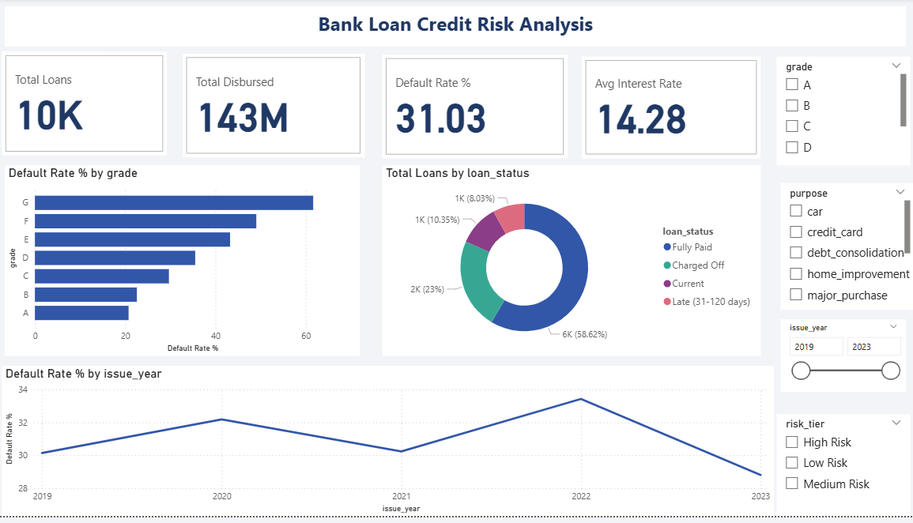
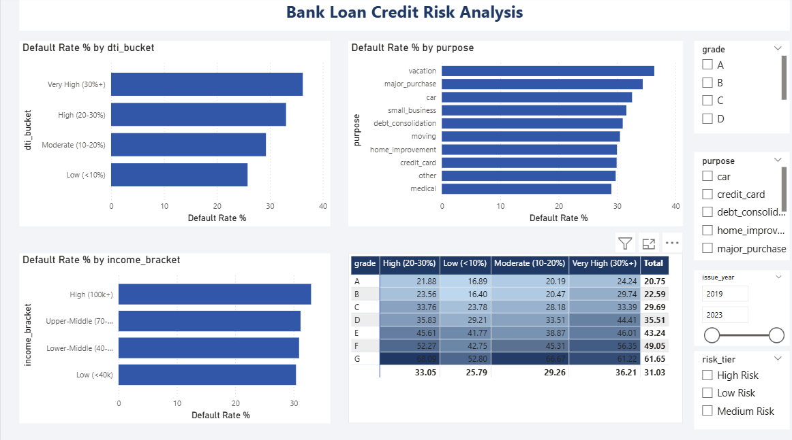

# 🏦 Bank Loan Credit Risk Analysis


> **End-to-end credit risk analysis of 10,000 loan records** — from raw data cleaning in Python, through SQL business-question analysis, to an interactive Power BI dashboard — identifying the key drivers of loan default to support smarter underwriting decisions.

---

## 📌 Project Overview

Loan default is one of the largest financial risks for lending institutions. This project analyzes a portfolio of **10,000 personal loans** modeled on LendingClub's real-world schema to answer:

- Which borrower and loan characteristics most strongly predict default?
- How does risk vary across loan grade, DTI, income, and loan purpose?
- Where are the highest-risk geographic and demographic segments?

---

## 🛠️ Tech Stack

| Stage | Tool | Purpose |
|---|---|---|
| Data Cleaning & EDA | Python (Pandas, NumPy) | Deduplication, imputation, feature engineering |
| Analysis | MySQL | 12 business-question SQL queries |
| Visualization | Power BI | 3-page interactive dashboard |
| Documentation | MS Word | Methodology report |

---

## 📂 Project Structure

```
bank-loan-credit-risk-analysis/
│
├── data/
│   ├── loan_data_raw.csv           # Raw synthetic dataset (10,015 rows)
│   └── loan_data_cleaned.csv       # Cleaned & feature-engineered dataset
│
├── python/
│   └── clean_data.py               # Data cleaning + feature engineering script
│
├── sql/
│   └── credit_risk_analysis.sql    # Schema + 12 business-question queries
│
├── powerbi/
│   └── credit_risk_dashboard.pbix  # Power BI dashboard file
│
└── report/
    └── Methodology_Report.docx     # Full project methodology write-up
```

---

## 🔄 Project Pipeline

```
Raw CSV  →  Python Cleaning  →  MySQL Analysis  →  Power BI Dashboard
```

**1. Python — Data Cleaning & Feature Engineering**
- Removed 15 duplicate records
- Standardized inconsistent text casing (`home_ownership`, `purpose`)
- Imputed missing `annual_inc` using grade-wise median (more accurate than global median)
- Filled missing `revol_util` with overall median
- Flagged missing `emp_length` as `Unknown` (rather than assuming tenure)
- Engineered new features: `is_default`, `dti_bucket`, `income_bracket`, `risk_tier`, `loan_to_income`

**2. SQL — Business Question Analysis**
- Loaded cleaned data into `credit_risk_db.loans`
- Wrote 12 queries covering default rate by grade, DTI, purpose, income, state, employment length, and combined high-risk segments

**3. Power BI — Interactive Dashboard (3 pages)**
- Page 1: Executive Overview (KPIs, default by grade, loan status split, trend by year)
- Page 2: Risk Driver Analysis (DTI, purpose, income, Grade × DTI heatmap)
- Page 3: Geographic & Segment View (US map, state table, home ownership, employment length)

---

## 📊 Key Findings

### 1. Loan Grade is the Strongest Default Predictor

| Grade | Avg Interest Rate | Default Rate |
|---|---|---|
| A | 7.51% | 20.75% |
| B | 10.48% | 22.59% |
| C | 13.49% | 29.69% |
| D | 17.02% | 35.51% |
| E | 20.97% | 43.24% |
| F | 24.98% | 49.05% |
| G | 29.12% | **61.65%** |

### 2. Portfolio Summary
- 📋 Total Loans Analyzed: **10,000**
- 💰 Total Disbursed: **$142,615,000**
- ⚠️ Overall Default Rate: **31.03%**
- 🔴 Highest Risk Segment: Grade G + Very High DTI → **66.67% default rate**

### 3. DTI Matters More Than Raw Income
- Default rate rises from **25.8%** (DTI < 10%) to **36.2%** (DTI 30%+)
- Income bracket alone shows only weak correlation (30–33% across all brackets)
- → DTI is a stronger underwriting signal than income level

### 4. Loan Purpose Risk Ranking
| Highest Risk | Default Rate |
|---|---|
| Vacation | 36.4% |
| Major Purchase | 34.4% |
| Car | 32.6% |

### 5. Geographic Risk
- **Texas, Maryland, Florida** show the highest state-level default rates (33%+)

---
## 📸 Dashboard Preview

### Page 1 - Executive Overview


### Page 2 - Risk Driver Analysis


### Page 3 - Geographic View


---

## 💡 Business Recommendations

1. **Tighten underwriting** for Grade F/G applicants with DTI > 20% and prior delinquency (60%+ default rate)
2. **Re-evaluate pricing** for Grade G loans — realized default risk outpaces the rate premium
3. **Weight DTI more heavily** than income in risk scoring models
4. **Apply extra scrutiny** to vacation, major purchase, and auto loan applications
5. **Monitor regional concentration** risk in TX, MD, and FL portfolios

---

## ▶️ How to Run

### Python Cleaning
```bash
pip install pandas numpy
python clean_data.py
```

### SQL Analysis
```sql
-- In MySQL Workbench:
-- 1. Run the schema section to create credit_risk_db and loans table
-- 2. Import loan_data_cleaned.csv via Table Data Import Wizard
-- 3. Run Q1–Q12 queries from credit_risk_analysis.sql
```

### Power BI Dashboard
```
1. Open Power BI Desktop
2. Get Data → Text/CSV → select loan_data_cleaned.csv
3. Open credit_risk_dashboard.pbix
```

---

## 👩‍💼 About Me

**Ishwarya R** — Data Analyst | Python · SQL · Power BI · Tableau

🔗 [LinkedIn](https://linkedin.com/in/ishwarya-r-data-analyst)
🐙 [GitHub](https://github.com/ishuravi001)

---

> ⭐ If you found this project useful, feel free to star the repo!
